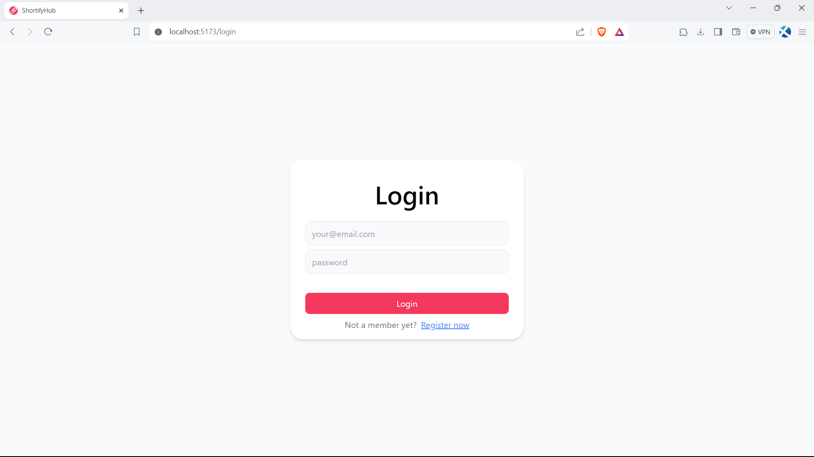

# ShortifyHub

A MERN stack url shortner application with personal dashboard


## Tech Stack

**Client:** React,Toastify, TailwindCSS.

**Server:** Node, Express, MongoDB, JWT.


## Screenshots





## Run Locally

Clone the project

```bash
  git clone https://github.com/sakethrambilla/shoritfyHub.git
```

Go to the frontend directory

```bash
  cd frontend
```

```bash
  npm install
```
Go to the Backend directory


```bash
  cd backend
```

```bash
  npm install
```

Start the server

```bash
  npm run start
```

Start the client

```bash
  npm run dev
```
